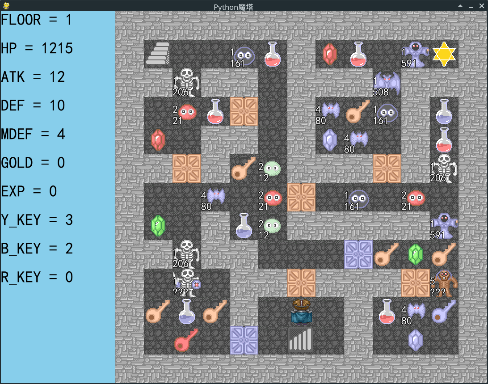
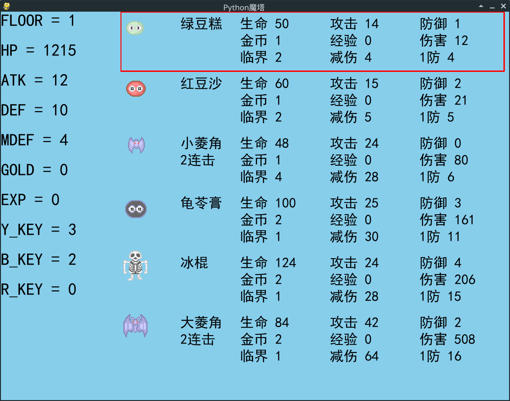
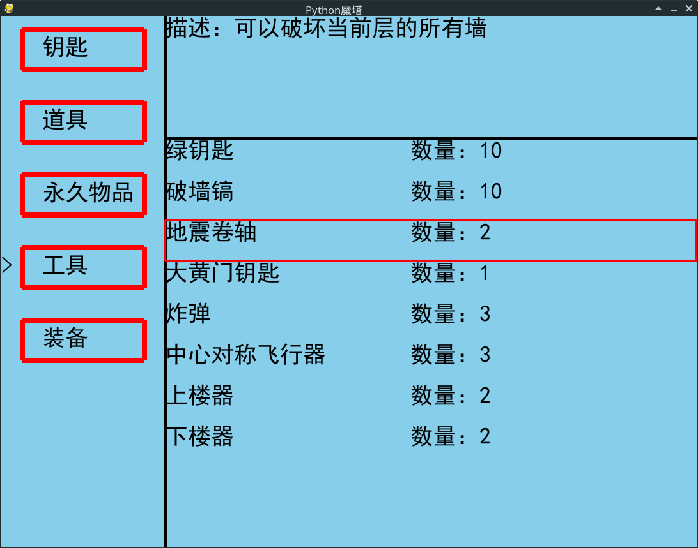
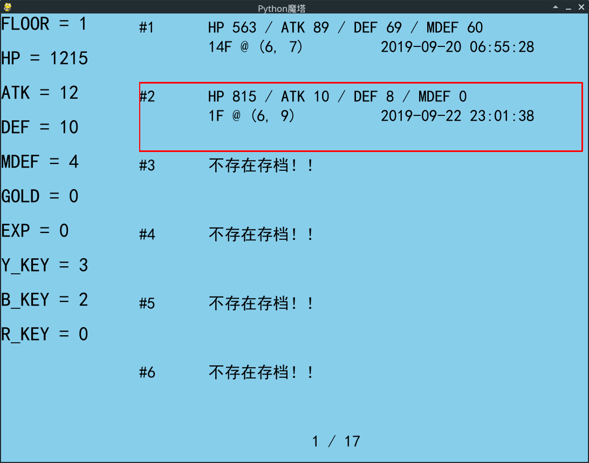

# Python 魔塔样板 （Magic Tower Python）

[Click here for English Version](./README_EN.md)

2020/01/07前排提示：pygame 1.9.6跟Python3.8有兼容问题，2.0.0.dev6据说是可以的，但是我还没测试。

还有，这个玩具级别的项目居然被各大Python营销号看上了，也是受宠若惊啊～

能被他们拿去做视频，应该也是从侧面说明这个项目还凑合吧，看来又有动力继续填坑了～

## 简介

使用Python的Pygame模块制作的魔塔样板，理论上支持全平台游戏！

  
    
  <b>游戏界面</b>
    
  
    
  <b>五毛特效的怪物手册</b>
    
  
    
  <b>五毛特效的道具背包</b>
    
  
    
  <b>五毛特效的存读档界面</b>

## 运行说明

电脑需要安装：

* Python3.6或3.7
* Pygame（从pip安装即可）

运行test.py即可进行游戏～

## 操作说明

Demo的游戏内容取自《中秋2019：桂魄》的咸鱼难度，应该挺容易的。目前游戏内容基本完整，实现了事件流，能够解析的事件会不断增加。游戏可以不依靠背包内的初始道具通关！不过如果实在是连咸鱼难度都打不过的话，那就随便用道具吧～

当前可用的快捷键：

* X = 怪物手册
* G = 楼层传送器
* T = 玩家背包（带分类二级菜单）
* S = 存档界面
* D = 读档界面
* A = 撤回上一关键步（打怪&开门）
* Z = 勇士转身（顺时针）
* H = 帮助界面
* B = 文本框Demo（测试用）
* P = 开关显伤层（默认开启）
* ESC = 一般情况用来在各种菜单中进行返回操作
* Enter = 一般情况用来在各种菜单中进行确认操作

在例如怪物手册，存档界面等菜单中，可以通过左右方向键快速跨页面移动高亮光标。

/tools文件夹下有一个使用Tkinter写的地图数据编辑器。这个编辑器非常简陋，但是能用，而且编辑完数值后会自动保存。

/tools文件夹下还有一个”一键H5魔塔地图转Python魔塔地图“工具，目前没有写GUI。这个转换器需要使用到json5这个包，因为H5魔塔中的地图文件并不是符合规范的JSON文件（关于这个问题可以搜索”trailing comma json“来了解更多）。常规的json包无法解析这样的JSON文件，所以只能使用json5。

## 更新说明

### 开发计划

* [ ] ESC键主菜单

### 【正在开发中】 V0.9.3

* [x] 全面应用新版ChoiceBox
* [x] sysconf中新增日志等级参数
* [x] 修复描边卡顿问题，速度得到显著提升
* [x] 修复换行处英文字体宽度计算错误问题
* [x] 显伤加入颜色，用以区分勇士受到伤害的程度
* [x] status_bar图层化
* [ ] 支持更多事件（例如setCurtain）
* [x] 怪物手册二级菜单（展示各种属性详情）
* [x] 修复商店买能力不刷新显伤层的问题
* [x] 优化画布刷新方式（lib/ground里的flush方法，改成不是active不刷新）
* [x] 增加静音模式（目前在sysconf控制，变量是MUTE）

描边卡顿的罪魁祸首就是在lib/ground中通过font = pygame.font.Font(font_name, size)反复生成新的font object，这个操作非常影响效率。现在使用新增的draw_bulk_text方法，显伤层平均每帧绘制时间从90.51ms提升到2.59ms（样本为连续的30帧），效率是原来的35倍。

英文宽度计算错误这个问题就比较蠢了，get_real_len在输入一个英文字母的时候，是返回0的，所以程序一直认为当前这行还没填满，不需要换行。其实直接把换行条件改一改，就行了。

status_bar图层化之后方便管理，但是每帧渲染时间+3ms。之后看看有没有办法变化才刷新。

还有一个特别消耗时间的操作就是lib/ground的flush，仔细检查才发现君浪大佬当时写的代码居然直接遍历并刷新全部图层，怪不得fps一直很低。简单修改之后目前只刷新active状态的图层。

反正经过各种优化，终于从7fps提升到34fps，现在看起来流畅多了~

### 2020.01.08 V0.9.2

最近有点忙，已经许久没有更新了。但是，坑是一定会填的，目前这个项目还有许多不足，我认为还不能算作成品，有些地方还是需要再打磨打磨。

* [x] 实现带Skin的ChoiceBox2（原ChoiceBox暂时保留，等待迁移完成再考虑删除）
* [x] 修复尝试读取空存档时的报错
* [x] 把lib/winbase.py整合到lib/ui.py中
* [x] 修复读档显伤层不刷新的问题
* [x] 补上了“platform.system()”掉的括号
* [x] 实验性载入初始事件
* [x] 实现地图显伤描边（draw_stroke_text）
* [x] 新增以下事件的解析：loadBgm, playBgm

功能删除：

* [x] 由于描边造成了显著的卡顿，暂时停用地图显伤描边，换回旧版显伤（fallback）

### 2019.09.23 V0.9.1

* [x] 实现自动存档（击杀怪物以及开门前会自动进行存档，A键读取自动存档）
* [x] 存读档界面下方显示页数
* [x] 修复存读档界面最后一页多显示一个存档位的问题
* [x] 事件解析类型使用dict而不是if分支
* [x] 优化显伤和临界的计算方式（同层重复怪物只计算一次）
* [x] 增加显伤和临界的缓存机制（不用在每帧刷新时重复计算）
* [x] 新增显伤层，默认开启。显伤层在地图之上，其它各类UI之下，并且不影响其它UI的使用

### 2019.09.22 V0.9.0

这是一个里程碑，因为在今天，Python魔塔样板跑通了测试用的《中秋2019：桂魄》咸鱼难度！

当然，目前只是跑通了测试塔，所以仍然需要继续完善Python魔塔样板的方方面面，例如UI，事件解析，特效等等。

在君浪大佬（dljgs1/虚风悠雨）和z触（zhaouv）的指点和帮助下，我作为一个非科班出身的业余爱好者，总算是做出了点成果！

最后，我想说的是：世上无难事，只怕有心人！

* [x] 重构function.py，将其改造成一个类。
* [x] 新增以下事件的解析：win, restart, battle
* [x] 修正状态栏（status_bar）的优先级问题
* [x] 战斗函数（battle）新增“强制战斗”（enforce）开关

### 2019.09.19 V0.8.5

* [x] 修复鬼步以及由此产生的鬼步穿墙问题（本质是禁止同时响应多个按键）
* [x] 新增以下事件的解析：callSave, choices, confirm, function
* [x] 新增与choices事件对应的ChoiceBox UI（注：choices跟confirm使用同一个UI）
* [x] 新增setValue中的"status:"解析
* [x] 存档现在可以记录/恢复当前在执行的事件列表

自定义JS语句事件（function）只能尽量去解析匹配，因为语言的不同，以及项目之间的一些结构差异，很难完全把JS语句转换成对应的Python语句。

### 2019.09.19 V0.8.4

* [x] 新增以下事件的解析：setValue, addValue, openShop, openDoor, playSound, sleep
* [x] 新增BlockDataReverse，是可以通过id反查地图编号的字典（例如：从"yellowKey"得到21）

### 2019.09.19 V0.8.3

* [x] 新增logger.py（Wrapper）模块，最终调用的是Python自带日志（logging）。
* [x] 实现了事件流，并能够解析基础的文字以及使用flag的if条件语句。（要体验具体效果，可以去2F使用地震卷轴后与NPC对话，或者去3F跟商店对话等等）

### 2019.09.17 V0.8.2

* [x] 文本框实现了根据文本切割后的行数来自适应高度
* [x] 修复了Windows系统下因为显示缩放比例造成的窗口过大（利用Python自带的ctypes模块）
* [x] 修复了从背包打开怪物手册崩溃的问题（其实是之前忘了在道具效果函数写）

### 2019.09.16 V0.8.1

* [x] 用上了文本框，在ui.py中新增TextBox这个Wrapper类。TextBox类内部是调用了winbase.py中的TextWin类。包装之后使得显示文本框更容易。

### 2019.09.15 V0.8.0

* [x] 实现了楼层传送器
* [x] 实现了游戏内帮助页面
* [x] 修复了使用背包内的constants道具会扣除的问题
* [x] 实现了大部分常见的怪物属性
* [x] 实现了商店
* [x] 新增npc.py，用来处理NPC的图片
* [x] 修改change_floor方法，增加其功能

已实现的怪物属性：0:无,1:先攻,2:魔攻,3:坚固,4:2连击,5:3连击,6:n连击,7:破甲,8:反击,9:净化,10:模仿,11:吸血,19:自爆,20:无敌,21:退化,22:固伤

未实现的怪物属性：12:中毒,13:衰弱,14:诅咒,15:领域,16:夹击,17:仇恨,18:阻击,23:重生,24:激光,25:光环

### 2019.09.15 V0.7.1

* [x] 在utools.py中增加get_time方法，用于获取当前时间
* [x] 存档增加当前时间和玩家角色的朝向
* [x] 存读档界面现在能够显示详细信息，并由每页4条变成每页6条（充分利用空间）

### 2019.09.14 V0.7.0

* [x] 增加4种不可通行的障碍（两种墙，星空，岩浆）
* [x] 修复了玩家可以直接穿过花门的问题
* [x] 增加Z键转向（转向有冷却时间设定，避免操作响应太过灵敏）
* [x] 玩家现在可以在sysconf.py里头调节勇士行走速度，目前默认速度是125
* [x] 新增音乐包装类（music.py中的MusicWrapper类），操作音乐音效更容易
* [x] 将sound文件夹拆分成BGM和SE两个文件夹，所有BGM和SE无需任何注册即可直接使用。
* [x] 实现进行特定操作时音效的播放
* [x] 实现一些获取怪物特殊能力相关内容的接口
* [x] 实现了部分的怪物特殊能力（例如：魔攻，连击，先攻）
* [x] 怪物手册现在能够显示对应怪物的动图和特殊能力（有些能力还没实现，比如“模仿”）
* [x] 实现了怪物手册中怪物伤害从小到大排列
* [x] 更换了自带demo，游戏内容取自《中秋2019：桂魄》
* [x] 新增一键H5魔塔地图转Python魔塔地图的工具

### 2019.09.13 V0.6.0

在摸鱼很久之后，我又回来啦～

* [x] 怪物显伤
* [x] 增加全局变量模块
* [x] 简陋的开始界面
* [x] 简陋的怪物手册
* [x] 重构ui.py，增加action.py，引入新的注册机制
* [x] 简陋的背包UI
* [x] 简陋的图形化地图编辑器
* [x] 具体存读档实现
* [x] 读档会把背包数组中str道具id转成int
* [x] 解决UI互相冲突问题
* [x] 解决勇士行走到边缘时，地图数组越界问题
* [x] 基本道具已经全部实现并测试通过
* [x] 实现背景音乐

### 2019.04.26 V0.5.1

* [x] 初步完成重构

当前待处理工作：
* 道具 - 背包UI，具体道具效果代码核查
* 怪物手册UI
* 怪物显伤
* 音效
* 存读档 - 界面UI，具体存读档实现
* 开始界面UI

### 2019.02.05 V0.5.0

* [x] 重构大部分显示代码实现以及工程目录分布
* [x] 实现画布系统，树形结构，统一管理，画布内使用相对坐标
* [x] 基于画布的地图显示模块，提供逻辑坐标和地图信息的访问接口，不再直接访问地图数据库
* [x] 素材分类管理，通过get_resource以标识符访问，素材改用带透明通道的png
* [x] 增加事件精灵EventSprite，实现怪物动画
* [x] 实现简单的控制台实时调试 

当前待处理工作：把旧有内容移植到新框架下（旧有部分除了素材目前仍然兼容）

### 2019.02.04 V0.4.0

* [x] 修复若干bugs
* [x] 简单怪物手册实现
* [x] 简单怪物显伤实现
* [x] 完成大部分道具效果

### 2019.02.01 V0.3.1

* [x] 废除get_item函数并改用pick_item函数
* [x] 增加use_item函数
* [x] 引入HTML5魔塔样板的item数据并存放到items.py
* [x] 完成部分道具的实现
* [x] 将地图数据分离到tower_map.py
* [x] 将怪物数据分离到monster.py
* [x] 将地图数据映射表分离到id_map.py
* [x] 废除tower_database.py

### 2019.01.31 V0.3.0

* [x] 添加ActorSprite
* [x] 实现勇士动态行走图
* [x] 补全get_item函数
* [x] 完成不同函数间坐标的对接
* [x] 移动所有常数到sysconf.py
* [x] 修复crop_image函数切图错误
* [x] 修复get_damage_info函数破防判断错误
* [x] 本次自带demo取自《生命之林》魔塔的一部分

### 2019.01.29 V0.2.0

* [x] 实现上下楼以及开门的处理
* [x] 增加change_floor函数
* [x] 增加open_door函数
* [x] 增加check_map函数

### 2019.01.29 V0.1.0

* [x] 增加crop_image函数

### 2019.01.28 V0.0.1

* [x] 发布初版Python魔塔样板的雏形
